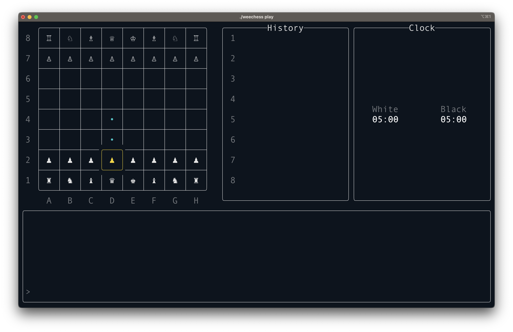

# Weechess


A wee-litle chess engine library and application.




## About

Weechess is a small chess engine that is UCI compatible and features a terminal UI mode. From a technical standpoint,
the engine implementation features:
 * Compact bit-board format for storing game data
 * Magic-number tables for fast rook, bishop, and queen attack calculations
 * Minimax search with alpha-beta pruning and transposition tables with zobrist hashing
 * A simple, heuristic based position evaluator
 * A decent amount of tests

When architectural simplicity or code readability is in conflict with performance, this engine
has chosen the former in an attempt to provide a decently understandable reference for other
developers building their own chess engines.

The engine is also factored to produce a c++ library that can be used independently of the
bundled UCI server or terminal application binaries.


## Usage

```bash
$ weechess --help

Usage: ./weechess [--help] {play,uci}

A chess engine for the terminal

Optional arguments:
  --help

Subcommands:
  play   Play an interactive game in the terminal.
  uci    Start a weechess UCI server
```


## Getting Started

Build the project from source using CMake:

```bash
mkdir build && cd build
cmake ../
make
```

To run the tests after building the project:

```bash
make && make test
```

To re-generate the book data that is bundled in the library:

```bash
make && ./weechess-bookc ../data/*.txt > ../lib/generated/book_data.cpp
```
